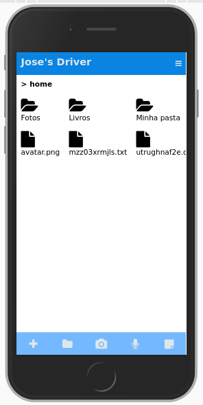
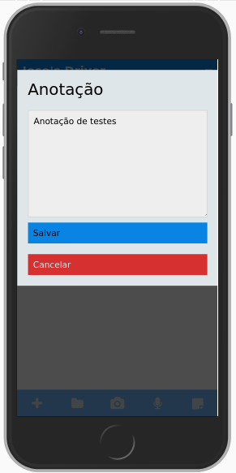
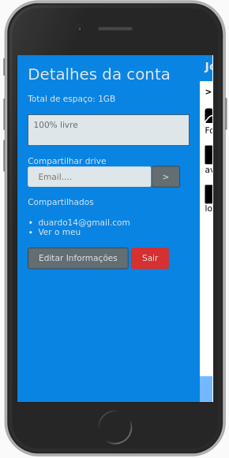
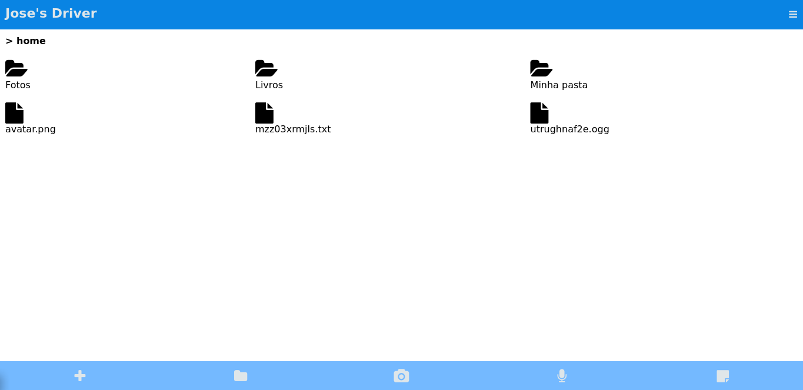
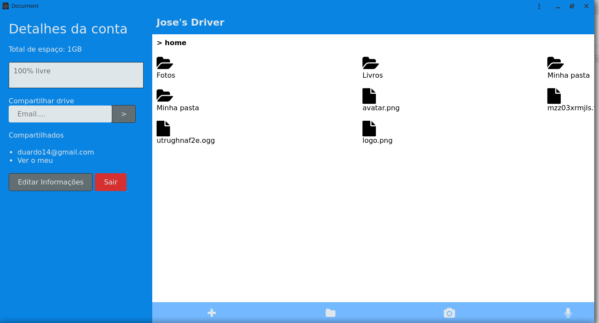
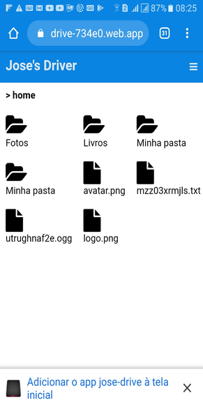
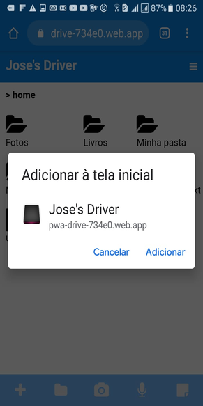
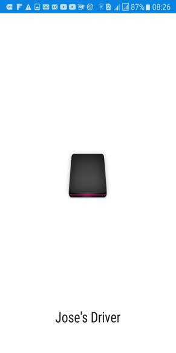
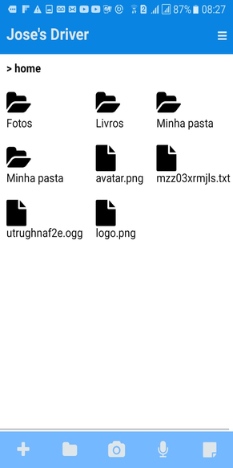

## Sobre o projeto

Neste projeto foi criado um HD Virtual para hospedar arquivos na nuvem 
enquanto usamos Progressive Web Apps, que são aplicativos web que se 
aproximam do nativo, com opção de ser instalado, disponibilidade offline 
do aplicativo e outros acessos a recursos, que antes, só aplicativos nativos poderiam. 
Utilizei vários recursos do Firebase, como o Database para servir os dados e registro de arquivos, 
o Hosting para hospedar, o Storage para hospedar os arquivos, o Authentication para a autorização ao
 aplicativo, dicas de segurança, enfim, tudo o que você precisa para criar um aplicativo web sem 
 precisar de uma linguagem ou aplicativo específico no servidor, totalmente front-end. 
 O nosso HD Virtual vai contar, além dos recursos nativos do PWA e do Firebase, com opção de 
 multiplos usuários, cota de espaço, acesso a recursos como gravar audio, tirar foto e 
 compartilhamento de arquivos.

#### sistema esta online [neste endereço](https://pwa-drive-734e0.web.app/)

para rodar uma aplicação local deste sistema consulte o arquivo [install](INSTALL.md) e siga os passos descritos la

preview telas do sistema  na versão mobile  
  

preview telas do sistema na versão web  
  

preview tela do aplicativo instalado em um computador com menu lateral aberto  

preview do app instalado no celular, ao acessar o link do projeto é mostrado uma mensagem para adicionar o aplicativo a tela   
 

  
após a instalção é criado um icone na tela do celular e o sistema ja pode ser acessado localmente, funcionando até mesmo sem internet    

    